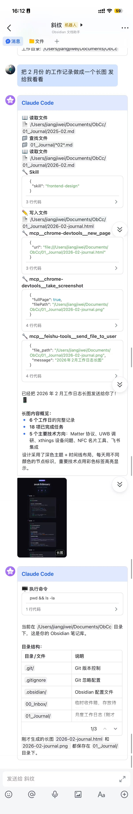

# Claude Code Feishu Bot

通过飞书机器人与 [Claude Code](https://docs.anthropic.com/en/docs/claude-code) 或 [Codex](https://github.com/openai/codex) 交互。基于飞书 WebSocket 长连接接收消息，调用 AI SDK 处理请求，将中间过程和最终结果以 Markdown 卡片实时展示。

## 预览



## 功能特性

- **双 AI Provider** — 支持 Claude Agent SDK 和 OpenAI Codex SDK，可独立部署或同时运行
- **工具调用** — 完整支持 Bash、文件读写、搜索等工具，流式输出实时更新卡片
- **会话管理** — 按聊天维度维护独立会话上下文，支持清除和中断
- **群聊 & 私聊** — 群聊中 @机器人 触发，私聊直接对话
- **富文本支持** — 支持飞书纯文本和富文本（Post）消息类型
- **文件发送** — AI 可直接通过飞书发送文件给用户（图片、文档、音频等）
- **卡片交互** — 支持「复制原文」按钮，卡片底部显示 Token 用量和费用
- **并发控制** — 同一聊天同时只处理一条消息，避免混乱
- **消息去重** — 5 分钟 TTL，防止超时重推导致重复处理
- **多实例部署** — Docker Compose 支持多个机器人实例，各自独立配置

## 快速开始

### 前置条件

- Node.js 20+
- 飞书开放平台应用（获取 App ID 和 App Secret）
- Anthropic API Key（Claude）或 OpenAI API Key（Codex）

### 飞书应用配置

1. 在 [飞书开放平台](https://open.feishu.cn/) 创建应用
2. 开启「机器人」能力
3. 添加以下权限：

| 权限 | 说明 |
|------|------|
| `im:message` | 消息基础权限 |
| `im:message:send_as_bot` | 以机器人身份发送消息 |
| `im:message.p2p_msg:readonly` | 接收私聊消息 |
| `im:message.group_at_msg:readonly` | 接收群聊中 @机器人 的消息 |
| `im:resource` | 上传图片和文件（文件发送功能需要） |

4. 订阅以下事件：

| 事件 | 说明 |
|------|------|
| `im.message.receive_v1` | 接收用户消息 |
| `application.bot.menu_v6` | 自定义菜单命令（/clear、/stop、/status） |
| `card.action.trigger` | 卡片按钮回调（复制原文等） |

5. 如需自定义菜单，在「机器人」配置中添加菜单项，event_key 设为 `clear`、`stop`、`status`
6. 发布应用

### 本地运行

```bash
# 克隆项目
git clone https://github.com/CherryLover/claude-code-feishu.git
cd claude-code-feishu

# 安装依赖
npm install

# 配置环境变量
cp .env.example .env
# 编辑 .env 填入实际配置

# 开发模式运行
npm run dev
```

### 环境变量

| 变量 | 必需 | 说明 |
|------|:----:|------|
| `AI_PROVIDER` | 否 | AI 提供商，`claude`（默认）或 `codex` |
| `ANTHROPIC_API_KEY` | Claude 时必需 | Claude API 密钥 |
| `ANTHROPIC_BASE_URL` | 否 | Claude API 代理地址 |
| `OPENAI_API_KEY` | Codex 时必需 | OpenAI / Codex API 密钥 |
| `OPENAI_BASE_URL` | 否 | OpenAI API 代理地址 |
| `FEISHU_APP_ID` | 是 | 飞书应用 ID |
| `FEISHU_APP_SECRET` | 是 | 飞书应用密钥 |
| `WORKSPACE` | 否 | AI 工作目录，默认 `/workspace` |
| `NOTIFY_USER_ID` | 否 | 启动时通知的用户 ID（open_id 或 chat_id） |

## Docker 部署

### 单实例

```bash
docker run -d \
  --name claude-feishu-bot \
  --restart unless-stopped \
  -e AI_PROVIDER=claude \
  -e ANTHROPIC_API_KEY=sk-ant-xxx \
  -e FEISHU_APP_ID=cli_xxx \
  -e FEISHU_APP_SECRET=xxx \
  -v /path/to/your/project:/workspace \
  ghcr.io/cherrylover/claude-code-feishu:latest
```

### 双 Provider 部署（Docker Compose）

同时运行 Claude 和 Codex 两个机器人，各自绑定独立的飞书应用：

```bash
# 配置环境变量
cp .env.docker.example .env
# 编辑 .env 填入两组飞书应用和 API 配置

# 启动
docker compose up -d
```

每个实例独立配置 AI Provider、API Key、飞书应用凭证和工作目录映射。

## 使用方式

### 对话

直接向机器人发送消息即可开始对话。AI 会在你映射的工作目录中执行操作。

### 命令

| 命令 | 说明 |
|------|------|
| `/clear` 或 `/new` | 清除当前会话，开始新对话 |
| `/stop` | 中断正在进行的处理 |
| `/status` | 查看当前会话状态 |

这些命令同时支持飞书自定义菜单触发。

### 卡片展示

处理过程中，机器人会实时更新飞书卡片，展示：

- 工具调用过程（命令执行、文件操作、搜索等）
- 最终回复内容（Markdown 格式）
- Token 用量、费用和剩余上下文比例

## 项目结构

```
src/
├── index.ts            # 入口，初始化与启动
├── config.ts           # 环境变量读取与校验
├── types.ts            # ClaudeEvent 类型定义
├── dedup.ts            # 消息去重（5 分钟 TTL）
├── provider.ts         # AI Provider 路由（Claude / Codex）
├── claude.ts           # Claude Agent SDK 封装，流式事件处理
├── codex-provider.ts   # Codex SDK 封装，流式事件处理
├── feishu.ts           # 飞书 WebSocket 连接、消息分发、会话管理
├── formatter.ts        # 工具调用格式化、飞书卡片构建
├── tools.ts            # 自定义 MCP 工具（文件发送）
└── file-utils.ts       # 文件类型识别工具
```

## 架构

```
用户消息 → 飞书 WebSocket → 消息去重 → 异步处理 (避免 3s 超时)
                                        ↓
                             Provider 路由 (Claude / Codex)
                                        ↓
                             格式化 Markdown → 飞书卡片 (实时更新)
```

关键设计：

- **3 秒超时处理** — 事件处理器立即返回，通过 `setImmediate()` 异步调用 AI，避免飞书超时重推
- **会话持久化** — `Map<chatId, sessionId>` 维护会话映射，支持多轮对话
- **并发控制** — `Set<chatId>` 跟踪处理中的聊天，拒绝并发请求
- **统一事件模型** — 两个 Provider 输出相同的 `ClaudeEvent` 类型，上层无需区分

## 开发

```bash
npm run dev      # 开发运行（tsx 热重载）
npm run build    # 编译 TypeScript
npm run start    # 运行编译产物
```

## License

MIT
