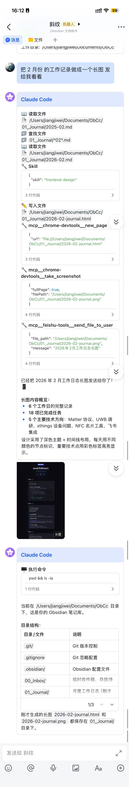

# Claude Code Feishu Bot

通过飞书机器人与 [Claude Code](https://docs.anthropic.com/en/docs/claude-code) 或 [Codex](https://github.com/openai/codex) 交互。基于飞书 WebSocket 长连接接收消息，调用 AI SDK 处理请求，将中间过程和最终结果以「卡片更新」或「逐条回复」两种模式展示。

## 预览



## 功能特性

- **双 AI Provider** — 支持 Claude Agent SDK 和 OpenAI Codex SDK，可独立部署或同时运行
- **工具调用** — 完整支持 Bash、文件读写、搜索等工具，可按开关展示调用/输入/结果
- **会话管理** — 按聊天维度维护独立会话上下文，支持清除和中断
- **群聊 & 私聊** — 群聊中 @机器人 触发，私聊直接对话
- **两人群直连** — 群内仅 1 个用户 + 1 个机器人时，可直接发消息触发，无需 @机器人
- **话题群降级** — 识别话题模式群，自动关闭进度卡，仅保留最终回复
- **单用户访问限制** — 可通过 `AUTHORIZED_USER_NAME` 只允许一个飞书用户名使用机器人
- **单用户工作目录** — 所有飞书消息统一使用单一工作目录（默认当前系统用户目录，可用 `MESSAGE_WORKSPACE` 覆盖）
- **富文本支持** — 支持飞书纯文本和富文本（Post）消息类型
- **文件发送** — AI 可直接通过飞书发送文件给用户（图片、文档、音频等）
- **进度卡 + 最终回复** — 固定使用单张进度卡展示当前执行项与计数，最终结果回复到用户原消息下；Token/上下文统计会追加在进度卡尾部
- **消息回执** — 收到消息后可给用户原消息添加 reaction，表示已收到并开始处理
- **并发控制** — 同一聊天同时只处理一条消息，避免混乱
- **消息去重** — 5 分钟 TTL，防止超时重推导致重复处理
- **定时任务** — 基于 SQLite 持久化 cron 配置，定时执行 AI 任务并主动推送飞书报告

## 快速开始

### 前置条件

- Node.js 20+
- 飞书开放平台应用（获取 App ID 和 App Secret）
- Anthropic API Key（Claude）或 OpenAI API Key（Codex）

### 飞书应用配置

1. 在 [飞书开放平台](https://open.feishu.cn/) 创建应用
2. 开启「机器人」能力
3. 添加以下权限：

| 权限 | 说明 |
|------|------|
| `im:message` | 消息基础权限 |
| `im:message:send_as_bot` | 以机器人身份发送消息 |
| `im:message.p2p_msg:readonly` | 接收私聊消息 |
| `im:message.group_at_msg:readonly` | 接收群聊中 @机器人 的消息 |
| `im:message.group_msg` | 可选；若要启用“两人群直连”，需要接收群内非 @ 消息 |
| `im:resource` | 上传图片和文件（文件发送功能需要） |

4. 订阅以下事件：

| 事件 | 说明 |
|------|------|
| `im.message.receive_v1` | 接收用户消息 |
| `application.bot.menu_v6` | 自定义菜单命令（/clear、/stop、/status） |
| `card.action.trigger` | 卡片按钮回调（复制原文等） |

5. 如需自定义菜单，在「机器人」配置中添加菜单项，event_key 设为 `clear`、`stop`、`status`
6. 发布应用

> 说明：两人群直连除了代码逻辑外，还依赖飞书开放平台允许机器人接收群内非 @ 消息；如果未开启对应权限，机器人仍然只能收到 @ 消息。

### 本地运行

```bash
# 克隆项目
git clone https://github.com/CherryLover/claude-code-feishu.git
cd claude-code-feishu

# 安装依赖
npm install

# 配置环境变量
cp .env.example .env
# 编辑 .env 填入实际配置

# 开发模式运行
npm run dev
```

### 环境变量

| 变量 | 必需 | 说明 |
|------|:----:|------|
| `AI_PROVIDER` | 否 | AI 提供商，支持 `claude`、`codex`，也支持 `claude,codex` 同进程同时启动 |
| `ANTHROPIC_API_KEY` | Claude 时必需 | Claude API 密钥 |
| `ANTHROPIC_BASE_URL` | 否 | Claude API 代理地址 |
| `OPENAI_API_KEY` | Codex 时必需 | OpenAI / Codex API 密钥 |
| `OPENAI_BASE_URL` | 否 | OpenAI API 代理地址 |
| `FEISHU_APP_ID` | 是 | 飞书应用 ID |
| `FEISHU_APP_SECRET` | 是 | 飞书应用密钥 |
| `WORKSPACE` | 否 | Provider 备用工作目录，默认 `/workspace` |
| `AUTHORIZED_USER_NAME` | 否 | 仅允许该飞书用户名使用机器人 |
| `MESSAGE_WORKSPACE` | 否 | 飞书消息统一使用的单用户工作目录，默认当前系统用户目录；兼容旧的 `DEVELOPER_WORKSPACE` |
| `SCHEDULER_ENABLED` | 否 | 是否启用定时任务调度，默认 `false` |
| `SCHEDULER_DB_PATH` | 否 | SQLite 文件路径，默认 `<项目目录>/data/scheduler.sqlite` |
| `SCHEDULER_TASK_TIMEOUT_MS` | 否 | 定时任务单次执行超时，默认 `600000`（10 分钟） |
| `NOTIFY_USER_ID` | 否 | 启动时通知的用户 ID（open_id 或 chat_id） |
| `FEISHU_REPLY_FORMAT` | 否 | 最终 reply 正文格式：`md`（默认）或 `text` |
| `FEISHU_REPLY_SHOW_USAGE` | 否 | 是否在进度卡尾部展示 Token/费用（Claude 额外显示上下文占用） |
| `FEISHU_REPLY_ACK_REACTION` | 否 | 收到消息后是否给用户原消息添加 reaction |
| `FEISHU_REPLY_ACK_EMOJI` | 否 | reaction 的 emoji 类型，默认 `OK` |

多 Provider 单进程模式下，可继续使用现有前缀变量覆盖各自配置，例如：`CLAUDE_FEISHU_APP_ID`、`CLAUDE_FEISHU_APP_SECRET`、`CODEX_FEISHU_APP_ID`、`CODEX_FEISHU_APP_SECRET`、`CLAUDE_SCHEDULER_DB_PATH`、`CODEX_SCHEDULER_DB_PATH`。

## 使用方式

### 对话

直接向机器人发送消息即可开始对话。AI 会在你映射的工作目录中执行操作。

### 命令

| 命令 | 说明 |
|------|------|
| `/clear` 或 `/new` | 清除当前会话，开始新对话 |
| `/stop` | 中断正在进行的处理 |
| `/status` | 查看当前会话状态 |

这些命令同时支持飞书自定义菜单触发。

### 定时任务

当前定时任务按 **单实例 + SQLite** 设计。启用方式：

```bash
export SCHEDULER_ENABLED=true
```

启用后，除了本地 CLI，你也可以直接在飞书里让 AI 管理定时任务，例如：

```text
每天工作日早上 9 点半，检查 workspace/shared 里的 git 变更，然后把日报发到当前群
把刚才那个日报改成每天 10 点
先暂停这个日报
看看我现在有哪些定时任务
立即执行一次日报
```

AI 会优先调用内置的 `schedule_*` 工具，把任务写入 SQLite，并由运行中的调度器自动同步生效。

任务通过本地 CLI 管理：

```bash
# 查看任务
npm run schedule -- list

# 新增任务
npm run schedule -- add \
  --id daily-report \
  --name "Daily Report" \
  --cron "0 30 9 * * 1-5" \
  --target-type chat_id \
  --target-id oc_xxx \
  --working-directory ./workspace/shared \
  --prompt "请总结工作目录昨天的变更，并输出日报"

# 修改任务
npm run schedule -- update \
  --id daily-report \
  --cron "0 0 10 * * 1-5"

# 启用 / 停用
npm run schedule -- enable --id daily-report
npm run schedule -- disable --id daily-report

# 手动执行一次
npm run schedule -- run --id daily-report

# 查看执行记录
npm run schedule -- runs --id daily-report
```

说明：

- 定时任务结果会主动发送到配置的 `chat_id` 或 `open_id`
- 定时任务默认独立执行，不复用聊天会话上下文
- 当前实现不处理多实例重复触发
- SQLite 会保存任务配置和执行历史

### 消息展示方式

机器人固定采用统一流程：

1. 给用户原消息添加 reaction 回执
2. 发送并持续更新一张进度卡
3. 最终结果使用 `reply` 回复到用户原消息下

进度卡默认展示摘要信息；开启 `FEISHU_REPLY_SHOW_USAGE` 后，会在完成时追加 Token / 费用统计（Claude 还会显示上下文占用）：

- 当前执行项（工具名 + 简单参数摘要，思考单独显示为“思考中”）
- 工具调用次数
- 思考次数
- 耗时

可通过环境变量控制最终 reply 的展示细节：

- `FEISHU_REPLY_FORMAT`：最终正文格式，`md`（默认，post 富文本 md 节点）或 `text`（纯文本）
- `FEISHU_REPLY_SHOW_USAGE`：是否在进度卡尾部展示 Token/费用信息
- `FEISHU_REPLY_ACK_REACTION`：是否给用户消息添加 reaction 回执

## 项目结构

```
src/
├── config.ts                   # 全局配置与环境变量
├── index.ts                    # 入口，多 Provider 启动器
│
├── core/                       # 核心业务逻辑
│   ├── bot-runner.ts          # 单 Provider 运行器
│   ├── bot-worker.ts          # Worker 进程封装
│   ├── bot-env.ts             # 环境变量覆盖逻辑
│   ├── task-executor.ts       # AI 任务执行器
│   ├── task-progress.ts       # 进度状态管理
│   └── dedup.ts               # 消息去重（5 分钟 TTL）
│
├── providers/                  # AI Provider 层
│   ├── index.ts               # Provider 路由
│   ├── claude.ts              # Claude Agent SDK 封装
│   ├── codex.ts               # Codex SDK 封装
│   └── types.ts               # 统一事件类型定义
│
├── feishu/                     # 飞书集成层
│   ├── client.ts              # WebSocket 客户端与消息分发
│   ├── api.ts                 # 飞书 REST API 封装
│   ├── messages.ts            # 消息发送与卡片更新
│   ├── actions.ts             # 飞书操作（文件上传等）
│   └── formatter.ts           # 工具调用格式化与卡片构建
│
├── scheduler/                  # 定时任务模块
│   ├── index.ts               # 模块导出
│   ├── cli.ts                 # CLI 管理工具
│   ├── db.ts                  # SQLite 数据库操作
│   ├── runner.ts              # 任务执行器
│   ├── service.ts             # Cron 调度服务
│   ├── actions.ts             # 任务管理操作
│   └── types.ts               # 类型定义
│
└── tools/                      # MCP 工具层
    ├── index.ts               # Claude Agent SDK MCP 工具
    ├── mcp-server.ts          # Codex CLI stdio MCP 服务器
    └── file-utils.ts          # 文件类型识别工具
```

## 架构

```
用户消息 → 飞书 WebSocket → 消息去重 → 异步处理 (避免 3s 超时)
                                        ↓
                             Provider 路由 (Claude / Codex)
                                        ↓
                             格式化输出 → 飞书卡片或回复消息
```

关键设计：

- **3 秒超时处理** — 事件处理器立即返回，通过 `setImmediate()` 异步调用 AI，避免飞书超时重推
- **会话持久化** — `Map<chatId, sessionId>` 维护会话映射，支持多轮对话
- **并发控制** — `Set<chatId>` 跟踪处理中的聊天，拒绝并发请求
- **单用户访问限制** — 配置 `AUTHORIZED_USER_NAME` 后，仅同名用户可继续使用机器人，其他人会收到未开放提示
- **单用户工作目录** — 所有消息统一使用 `MESSAGE_WORKSPACE`（默认当前系统用户目录，兼容旧的 `DEVELOPER_WORKSPACE`），不再按 `open_id` 动态创建目录
- **统一事件模型** — 两个 Provider 输出相同的 `ClaudeEvent` 类型，上层无需区分

## 开发

```bash
npm run dev      # 开发运行（tsx 热重载）
npm run build    # 编译 TypeScript
npm run start    # 运行编译产物
npm run schedule -- list   # 查看定时任务
```

## License

MIT
